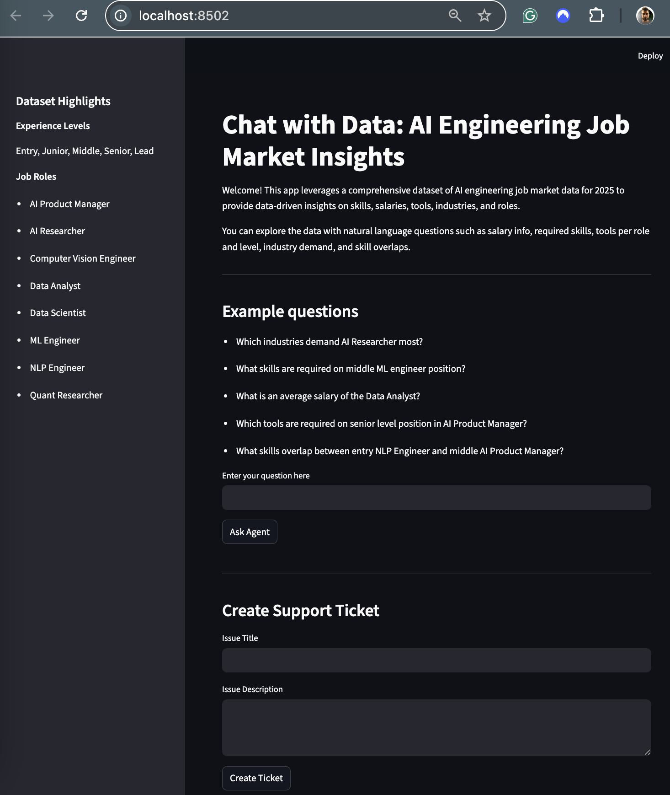
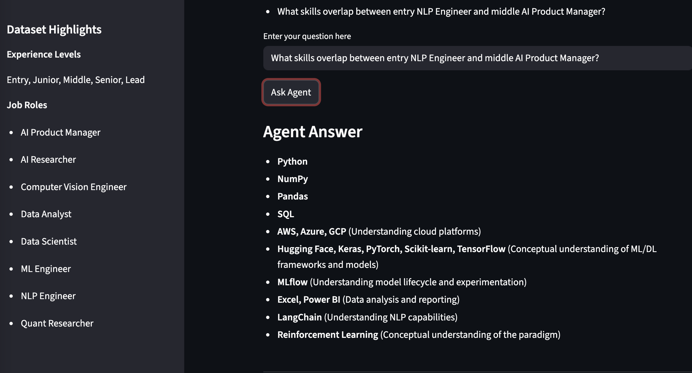
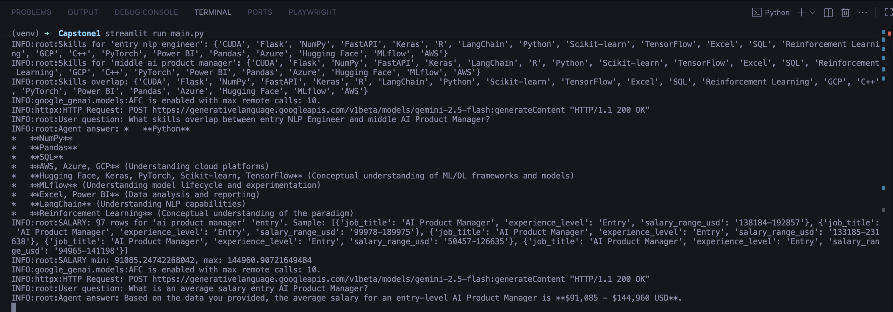
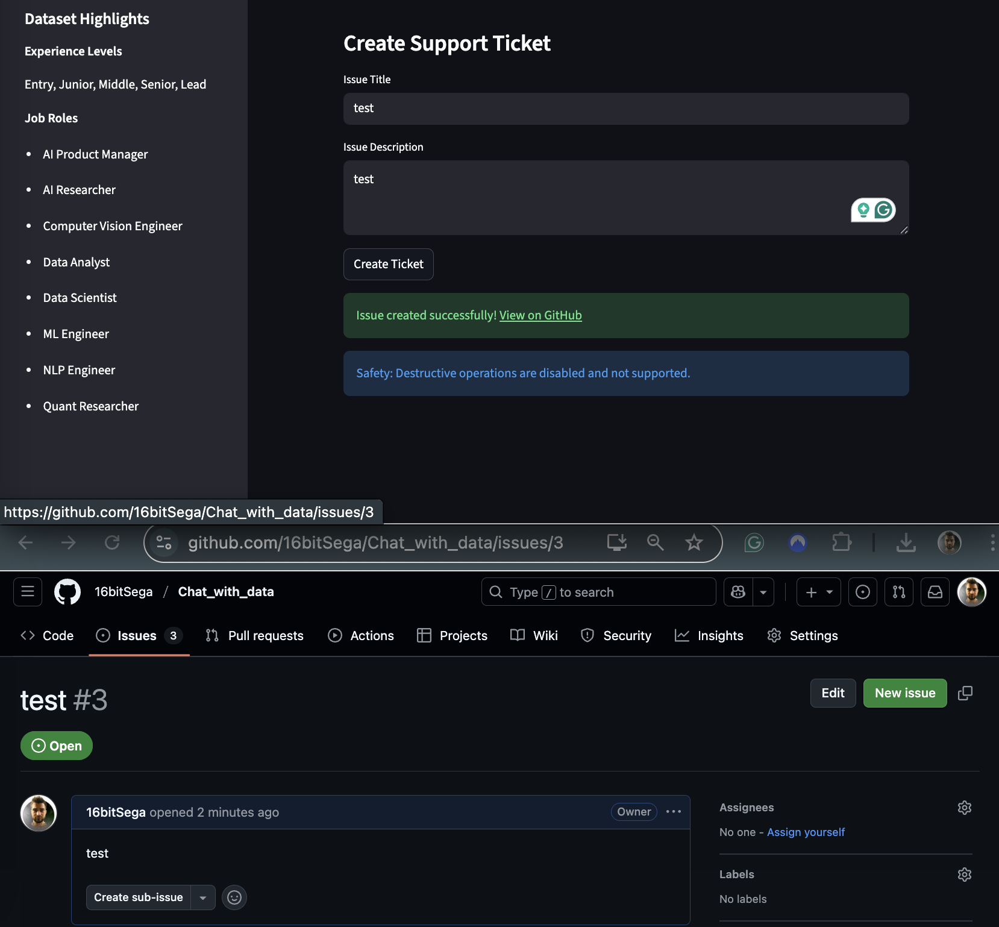

# Chat with Data: AI Engineering Job Market Insights

Welcome! This Streamlit app helps you chat with the 2025 AI engineering job market dataset using Google Gemini LLM. Instantly discover skills, tools, salaries, industry trends, and compare roles—using natural language Q&A.

🚀 Features
Conversational Q&A on AI job market insights

Dataset-powered answers about skills, tools, salaries, industry demand, and roles

Skill overlap and comparison between roles or experience levels

GitHub issue creation for instant feedback and support

Sidebar with dataset highlights for fast reference

📦 Dataset Highlights
Experience Levels:
Entry, Junior, Middle, Senior, Lead

Job Roles:

AI Product Manager
AI Researcher
Computer Vision Engineer
Data Analyst
Data Scientist
ML Engineer
NLP Engineer
Quant Researcher

Other columns: required skills, preferred tools, salary (USD), region, industry

## 🛠️ Installation & Setup

### 1 Clone the repository

```bash
git clone https://github.com/16bitSega/Chat_with_data.git
cd Chat_with_data
```

### 2 Create a virtual environment (optional but recommended)

```bash
python -m venv venv
# macOS / Linux
source venv/bin/activate
# Windows
venv\Scriptsctivate
```

### 3 Install dependencies

```bash
pip install -r requirements.txt
```

`requirements.txt` includes:

```text
streamlit
pandas
numpy
python-dotenv
google-genai
requests
```

---

### 4 Configure environment variables (`.env`)

Create a file named `.env` in the `Chat_with_data` directory (next to `main.py`):
PS: You could ignore the part related to GITHUB if you are not waiting for a support ticket addressing your account :)

```env
GOOGLE_API_KEY=your_gemini_api_key_here
GITHUB_TOKEN=your_github_token
GITHUB_REPO=your_github_user/repo_name
```

#### 4.1 Get a Gemini API key

1. Open **Google AI Studio**.
2. Sign in and go to the **API Keys** section.
3. Create a new API key and copy it into `GOOGLE_API_KEY`.

### 5. Add dataset: Place ai_job_market.csv in the project root.

▶️ Running the App

From the `Chat_with_data` directory:

```bash
streamlit run main.py
```

Streamlit will print a local URL (usually `http://localhost:8501`) — open it in your browser.

---

## Usage workflow with screenshots

### Initial state — Home screen (`home.png`)

When you open the app, you see:

- The app title and description.
- Dataset information on the left sidebar
- A **Example questions** section to help you get started.

This represents the initial state of the Data Insights App before any user interaction.



---

### Answering the question (`answer.png`)

User is asking **What skills overlap between entry NLP Engineer and middle AI Product Manager?**

This action is searching for Skills that are represented in roles matching their levels



---

### Console logs (`console.png`)

The app logs key events to the console using Python’s `logging` module

This screenshot shows a real console session during interaction, confirming that:

- The agent uses function calling to invoke tools
- Database queries are executed and results printed to the console



### Ticket creation (`ticket.png`)

The form allows you to add the title and description, and the ticket will be added to the **Issues**
On the GitHub page related to the project.



📄 License
MIT
